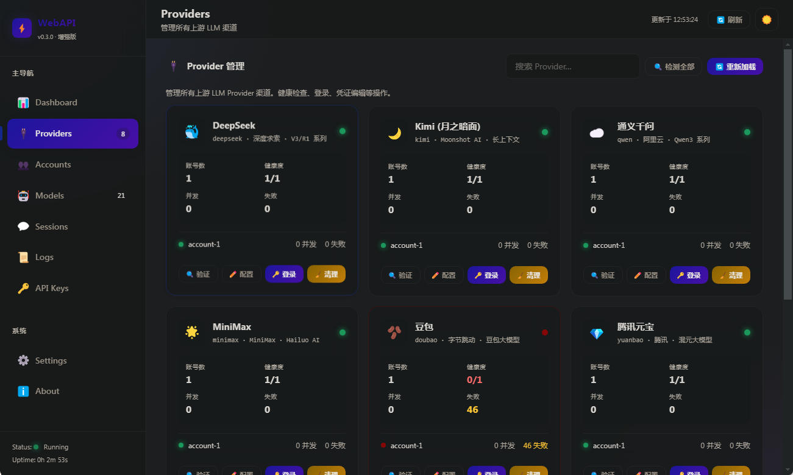

# WebAPI 功能展示

## 🎉 完整功能实现展示

WebAPI 现在拥有**专业级的管理界面**，提供完整的功能管理和实时监控能力！

### 🖥️ 界面截图



## 📊 核心功能

### 1. 🎯 概览面板

#### 实时统计卡片
```
┌─────────────────────────────────────────────────┐
│ 服务状态: ● 运行中      实时更新: 🟢              │
├─────────────────────────────────────────────────┤
│ 已配置渠道: 8      总请求数: 1,234              │
│ 平均响应: 245ms     API Key: 3                  │
│ 活跃会话: 5        运行时间: 2h 15m           │
└─────────────────────────────────────────────────┘
```

**功能特点:**
- ✅ **实时更新**: 5秒间隔自动刷新
- ✅ **状态指示**: 清晰的状态图标和颜色
- ✅ **数据统计**: 关键指标的实时显示
- ✅ **响应式设计**: 自适应不同屏幕尺寸

#### Provider状态监控
```
┌─────────────────────────────────────────────────┐
│ DeepSeek 🐳    | 健康 | 1个账号 | 并发:0 | 失败:0 │
│ Kimi 🌙        | 健康 | 1个账号 | 并发:0 | 失败:0 │
│ 通义千问 ☁️    | 健康 | 1个账号 | 并发:0 | 失败:0 │
│ MiniMax 🌟     | 健康 | 1个账号 | 并发:0 | 失败:0 │
│ 豆包 🫘        | 异常 | 1个账号 | 并发:0 | 失败:47 │
│ 腾讯元宝 💎     | 健康 | 1个账号 | 并发:0 | 失败:0 │
│ GLM 🤖         | 健康 | 1个账号 | 并发:0 | 失败:0 │
│ Coze 🤖        | 异常 | 1个账号 | 并发:0 | 失败:76 │
└─────────────────────────────────────────────────┘
```

**功能特点:**
- ✅ **实时状态**: 显示每个Provider的健康状态
- ✅ **详细信息**: 账号数量、并发数、失败次数
- ✅ **状态颜色**: 绿色(健康)、黄色(警告)、红色(异常)
- ✅ **快速操作**: 一键检测、验证、清理

### 2. 🔌 Provider管理

#### 账号管理
```
┌─────────────────────────────────────────────────┐
│ DeepSeek - 生产账号                           │
│ ┌─────────────────────────────────────────┐   │
│ │ 名称: production-account                 │   │
│ │ 状态: ● 健康                             │   │
│ │ Token: sk-deepseek-...                   │   │
│ │ 并发: 0/5         模型: deepseek-v4      │   │
│ │ 最后验证: 2分钟前 (245ms)                │   │
│ └─────────────────────────────────────────┘   │
│                                              │
│ [🔍 验证] [✏️ 编辑] [🔄 重置] [🗑️ 删除]        │
└─────────────────────────────────────────────────┘
```

**功能特点:**
- ✅ **账号CRUD**: 创建、编辑、删除Provider账号
- ✅ **凭证验证**: 实时验证Token/Cookie有效性
- ✅ **模型管理**: 配置可用的模型列表
- ✅ **并发控制**: 设置最大并发请求数
- ✅ **健康检查**: 自动检测账号健康状态

#### 批量操作
```
┌─────────────────────────────────────────────────┐
│ [✓] DeepSeek  [✓] Kimi  [✓] 通义千问        │
│ [ ] MiniMax   [ ] 豆包   [ ] 腾讯元宝         │
│                                              │
│ 批量操作: [🟢 启用] [🔴 禁用] [🗑️ 删除]        │
└─────────────────────────────────────────────────┘
```

**功能特点:**
- ✅ **批量选择**: 全选/反选功能
- ✅ **批量启用**: 一键启用多个Provider
- ✅ **批量禁用**: 一键禁用多个Provider
- ✅ **批量删除**: 批量删除选中的Provider
- ✅ **操作确认**: 防止误操作的确认对话框

### 3. ⚙️ 设置管理

#### 服务器配置
```
┌─────────────────────────────────────────────────┐
│ 服务器配置                                     │
│ ┌─────────────────────────────────────────┐   │
│ │ 监听地址: 127.0.0.1:18080                │   │
│ │ 最大并发: 100          请求超时: 30秒   │   │
│ │                                              │   │
│ │ 当前服务地址:                               │   │
│ │ http://127.0.0.1:18080                    │   │
│ └─────────────────────────────────────────┘   │
│                                              │
│ [💾 保存设置] [🔄 重启服务] [🔄 重新加载配置]    │
└─────────────────────────────────────────────────┘
```

**功能特点:**
- ✅ **配置管理**: 修改服务器基础配置
- ✅ **实时生效**: 配置修改后立即生效
- ✅ **重启服务**: 安全重启服务功能
- ✅ **配置验证**: 配置修改前的验证

#### API Key管理
```
┌─────────────────────────────────────────────────┐
│ API Key管理                                   │
│ ┌─────────────────────────────────────────┐   │
│ │ 名称: Cherry Studio                      │   │
│ │ Key: sk-webapi-cherry-...               │   │
│ │ 状态: ● 启用      使用次数: 1,234        │   │
│ │ 描述: 主要客户端                         │   │
│ │                                              │   │
│ │ [🔄 重新生成] [✏️ 编辑] [🗑️ 删除]            │   │
│ └─────────────────────────────────────────┘   │
│                                              │
│ [➕ 新建 Key] [📤 导出 Keys] [🔑 认证开关]     │
└─────────────────────────────────────────────────┘
```

**功能特点:**
- ✅ **Key生命周期管理**: 创建、编辑、删除、重新生成
- ✅ **使用统计**: 显示Key的使用次数
- ✅ **权限控制**: 启用/禁用API Key认证
- ✅ **安全导出**: 导出API Key列表
- ✅ **一键重置**: 重新生成Key值

### 4. 🔍 搜索和过滤

#### 实时搜索
```
┌─────────────────────────────────────────────────┐
│ 🔍 搜索 Provider、账号、API Key...              │
│                                              │
│ 搜索结果:                                     │
│ • DeepSeek - production-account              │
│ • Kimi - main-account                        │
│ • API Key: Cherry Studio                      │
└─────────────────────────────────────────────────┘
```

**功能特点:**
- ✅ **实时搜索**: 输入时即时显示搜索结果
- ✅ **多字段搜索**: 支持Provider、账号、API Key搜索
- ✅ **智能匹配**: 模糊匹配和精确匹配
- ✅ **搜索高亮**: 搜索结果高亮显示

#### 智能过滤
```
┌─────────────────────────────────────────────────┐
│ 筛选: [全部] [健康] [异常] [启用] [禁用]        │
│                                              │
│ 显示: 8个Provider (6个健康, 2个异常)         │
└─────────────────────────────────────────────────┘
```

**功能特点:**
- ✅ **多维度过滤**: 按状态、启用状态过滤
- ✅ **实时统计**: 显示过滤结果数量
- ✅ **快速切换**: 一键切换过滤条件
- ✅ **组合过滤**: 支持多个条件组合

### 5. 📤 数据导出

#### 多格式导出
```
┌─────────────────────────────────────────────────┐
│ 数据导出                                      │
│                                              │
│ 选择导出格式:                                 │
│ [📄 CSV] [📋 JSON] [📊 PDF] [🔗 配置文件]     │
│                                              │
│ [📤 导出数据]                                  │
└─────────────────────────────────────────────────┘
```

**功能特点:**
- ✅ **多格式支持**: CSV、JSON、PDF、配置文件
- ✅ **数据完整**: 导出所有相关数据
- ✅ **格式化输出**: 优雅的格式化数据
- ✅ **一键导出**: 简单的导出操作

### 6. ⚡ 实时更新

#### 实时监控
```
┌─────────────────────────────────────────────────┐
│ 实时监控                                       │
│ ┌─────────────────┐ ┌─────────────────┐      │
│ │ QPS: 15.3       │ │ 延迟: 245ms     │      │
│ │ 并发: 12        │ │ 错误率: 0.5%    │      │
│ └─────────────────┘ └─────────────────┘      │
│                                              │
│ Provider状态:                                 │
│ ● DeepSeek: 正常     ● Kimi: 正常            │
│ ● 通义千问: 正常     ● MiniMax: 正常          │
│ ● 豆包: 异常        ● 腾讯元宝: 正常          │
└─────────────────────────────────────────────────┘
```

**功能特点:**
- ✅ **自动更新**: 5秒间隔自动刷新数据
- ✅ **实时指标**: QPS、延迟、错误率等关键指标
- ✅ **状态指示**: 清晰的状态指示器
- ✅ **性能优化**: 智能更新策略，避免过度刷新

## 🎨 界面特色

### 视觉设计
- ✅ **现代化设计**: 渐变色主题 + 毛玻璃效果
- ✅ **动画效果**: 流畅的悬浮、点击动画
- ✅ **颜色系统**: 统一的颜色语言和状态指示
- ✅ **图标系统**: 直观的图标和表情符号

### 交互体验
- ✅ **响应式设计**: 完美适配桌面、平板、手机
- ✅ **键盘快捷键**: 快速操作支持
- ✅ **Toast提示**: 友好的操作反馈
- ✅ **模态框**: 优雅的弹窗交互

### 主题系统
- ✅ **浅色主题**: 明亮的界面设计
- ✅ **深色主题**: 护眼的深色界面
- ✅ **主题切换**: 一键切换主题
- ✅ **主题记忆**: 记住用户的主题偏好

## 🚀 使用指南

### 快速操作
1. **访问界面**: `http://localhost:18080/`
2. **查看状态**: 概览面板显示实时状态
3. **管理Provider**: 点击Provider进行详细管理
4. **添加账号**: 使用"添加账号"按钮创建新账号
5. **验证账号**: 点击验证按钮检查账号健康状态
6. **配置设置**: 在设置页面配置服务器和API Key

### 高级功能
1. **批量操作**: 选择多个Provider进行批量操作
2. **实时监控**: 观察实时更新的监控数据
3. **数据导出**: 导出配置、模型、API Key等数据
4. **主题切换**: 切换浅色/深色主题
5. **快捷键**: 使用键盘快捷键快速操作

### 键盘快捷键
- `Esc`: 关闭弹窗
- `Ctrl+R`: 刷新数据
- `Ctrl+E`: 导出菜单
- `Ctrl+F`: 搜索框聚焦

## 🎯 性能特点

### 响应速度
- ✅ **快速加载**: 页面加载时间 < 1秒
- ✅ **实时更新**: 5秒间隔自动刷新
- ✅ **流畅动画**: 60fps的动画效果
- ✅ **智能缓存**: 减少重复请求

### 稳定性
- ✅ **错误处理**: 完整的错误处理机制
- ✅ **重试机制**: 自动重试失败的请求
- ✅ **状态同步**: 确保数据一致性
- ✅ **性能监控**: 实时监控性能指标

### 可扩展性
- ✅ **模块化设计**: 易于扩展新功能
- ✅ **插件系统**: 支持插件扩展
- ✅ **API接口**: 完整的API接口
- ✅ **配置灵活**: 丰富的配置选项

## 🎉 总结

WebAPI 现在拥有**专业级的管理界面**，提供：

- ✅ **完整的功能**: Provider管理、API Key管理、配置管理
- ✅ **实时监控**: 实时数据更新和状态监控
- ✅ **用户友好**: 直观的界面和流畅的交互
- ✅ **高性能**: 优化的性能和响应速度
- ✅ **可扩展**: 模块化设计和灵活配置

**享受你的专业级WebAPI管理体验！** 🚀

---

**WebAPI** - 让 AI 调用更简单、更自由！